Shanaya is a ecommerce site. It sell Bridal dresses, Indo western dresses, Men sherwani & gown online.Variety of collection and clothes for sale on reasonable rate.

You can reach the live site here
___________________________

* Table of Contents:
__________________

<!-- . Business-Model -->
_________________________

<!--User Experience (UX)  -->
_________________________
User stories
____________
All user stories can be seen here Shanaya

* Site User Stories
____________________
. As a site user I want to be able to register for an account so that I can have a personal account with my delivery details saved

. As a site user I want to be able to login and logout so that I can access my profile info

. As a site user I want to be able to receive an email confirmation after sign up so that I can verify my account registration was successfull

. As a site user I want to be able to have a personalised user profile so that I can view my order history and delivery information

. As a site user I want to be able to leave a product review so that I can advise potential customers with my advise

. As a site user I want to be able to sign up to a newsletter so that I can get the latest news and offers

. As a **site user ** I want to be able to **unsubscribe for the newsletter ** so that I can stop receiving emails

. As a site user I can return to Home after http 404 or 500 response so that I feel I am still working within the website and can navigate easily

* Shopper User Stories
_______________________
. As a shopper I want to be able to view my total cost so that I can I don't spend too much

. As a shopper I want to be able to sort any list of products so that I can easily sort by price, best rated, etc

. As a shopper I want to be able to sort products into categories so that I can split products into categories to make it easier to find what I want

. As a shopper I want to be able to search a product by name so that I can easily find the product I am searching for

. As a shopper I want to be able to select a specific size so that I can I can make sure the product will suit my needs

. As a shopper I want to be able to view the items in my bag so that I can check out my bag contents and know exactly what I am buying

. As a shopper I want to be able to adjust the quantity of items in my bag so that I can easily make changes

. As a shopper I want to be able to enter my card details so that I can make a purchase

. As a shopper I want to be able to view my order after I complete a purchase so that I can verify I have not made any mistakes

. As a shopper I want to be able to receive an email confirmation after making a purchase so that I can keep the confirmation for any future needs

. As a shopper I want to be able to contact Shanaya so that I can get in touch regarding a product/ issue, etc

Admin Stories
______________

As an admin I want to be able to add a product so that I can I can add new products my store

As an admin I want to be able to edit a product so that I can make changes to any product

As an admin I want to be able to delete a product so that I can remove an item that is no longer for sale

As an admin I want to be able to view all messages from the contact form so that I can communicate with customers in a timely manner

As an admin I want to be able to view all messages from the contact form so that I can communicate with customers in a timely manner

As an admin I want to be able to view a list of subscribers in my admin so that I can see the amount of subscribers we have

. Site Goals
_____________
. Agile Planning
_______________
. Scope
_______________
. Structure
______________
. Shanaya Features:
_________________
. Home Page
___________

. Footer
_________

. Browse Items
______________

. Item Detail
_____________
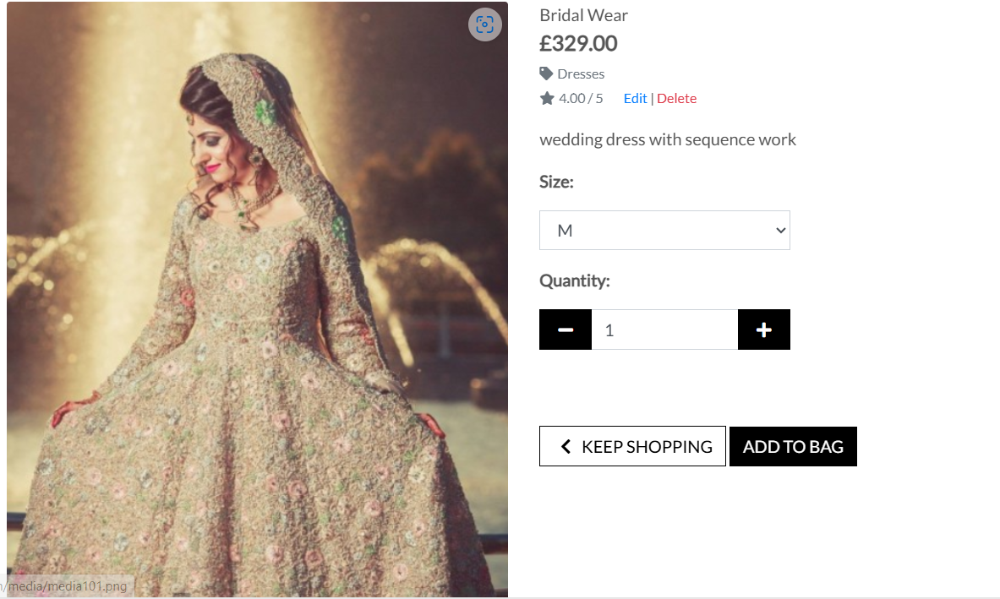

. Sign in, log in, log out

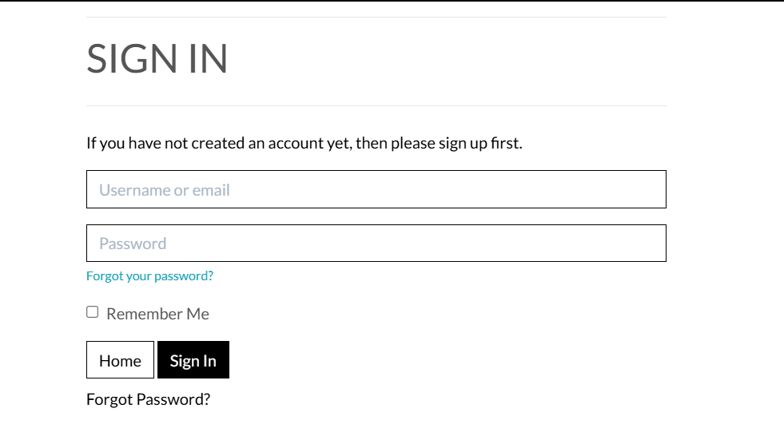

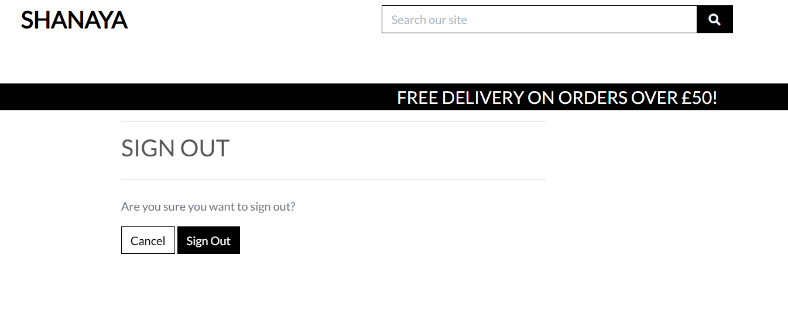

. Shopping Bag
______________

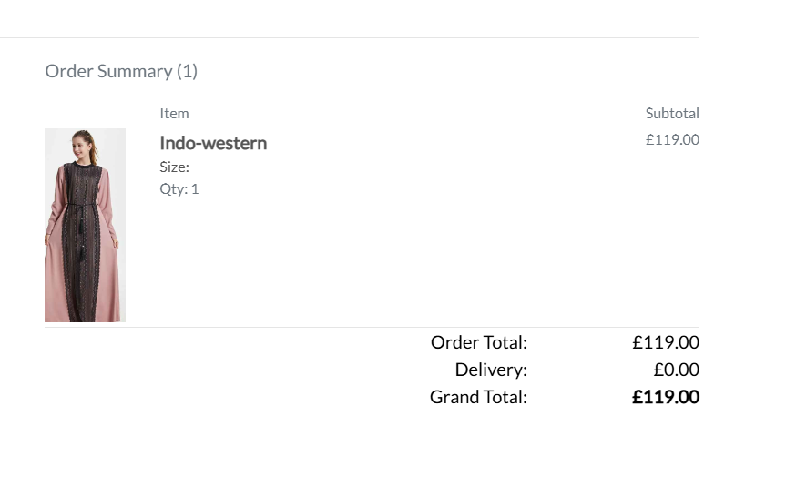

. Checkout Page
_______________
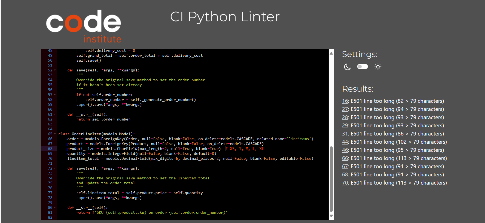

. Order Confirmation
____________________
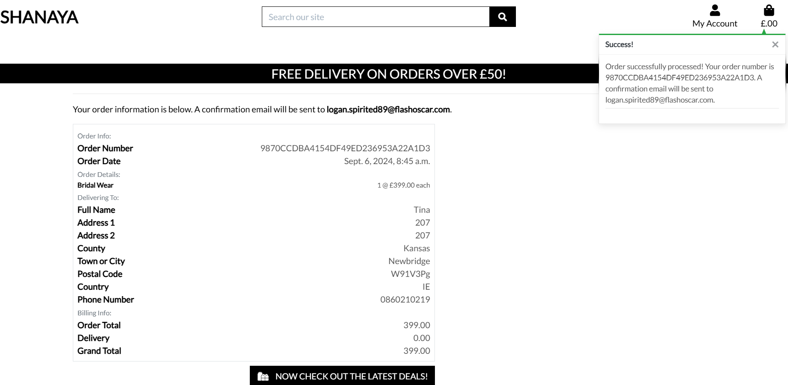

. Profile Page
______________
. Blog
______
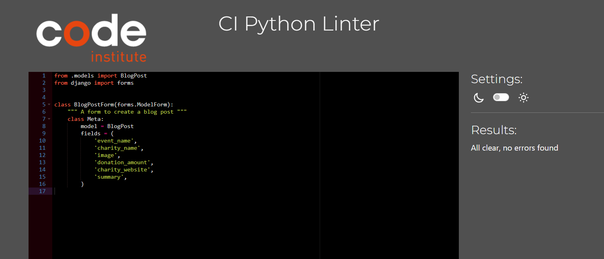

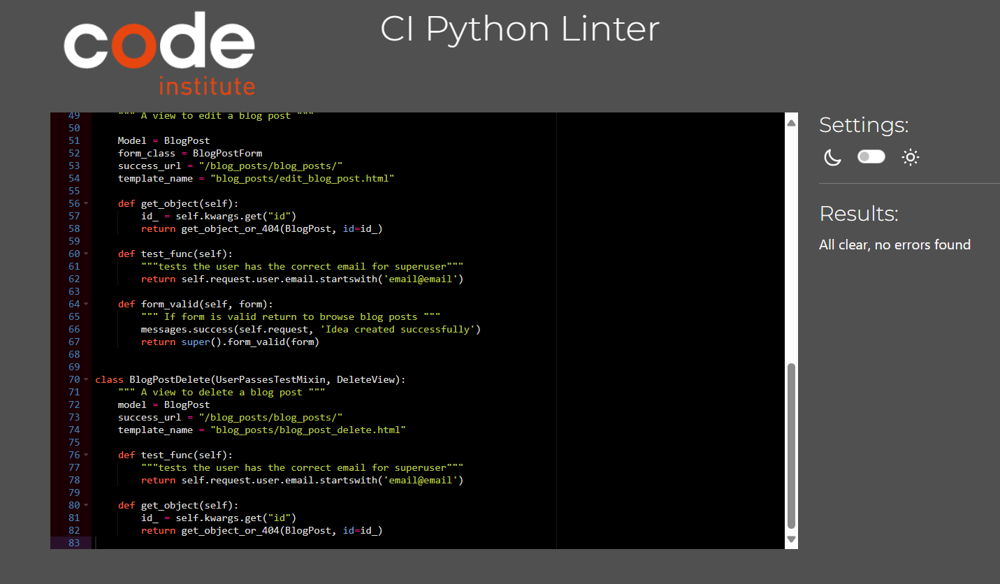

. Reviews
_________
. Subscribe
___________
. Keywords
__________
. Wireframes
____________

. Database
_________
. Security
__________

. Design
______
. Colour Scheme
_____________
. Typography
____________
. Imagery
_________
. Technologies
______________
. External Python Modules
___________________________
. Testing
_________

. Functional Testing
____________________
. Navigation Links
__________________
. Products page
------------------ 

. Product Details page
------------------ 
. Bridal Wear
-------------
. Sarees
--------
. Suits
-------
. cod_set
---------
. Dresses
---------
. Bag Icon
----------

. Shopping Bag
--------------
. Checkout
----------

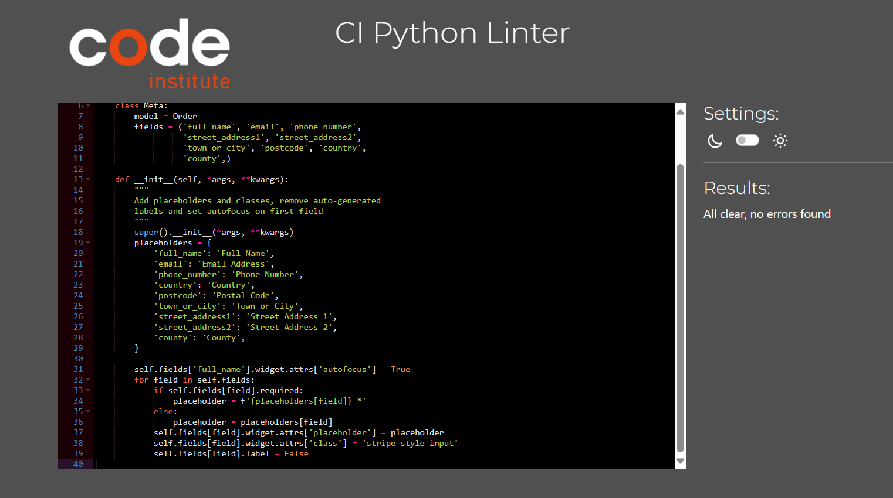

. Card Details
--------------
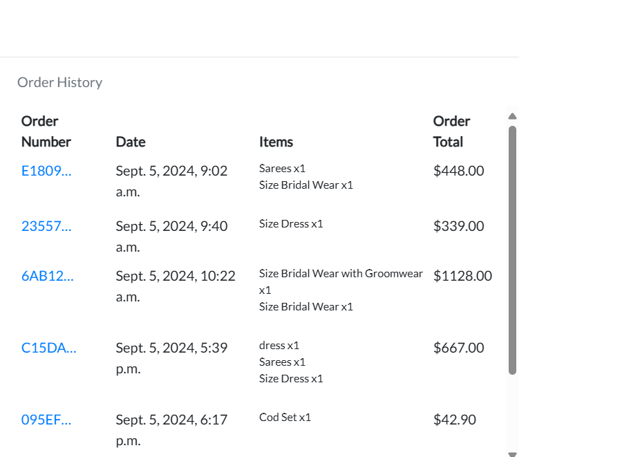

. Order Confirmation
------------------ 

. Stripe
--------

. Profile Page
--------------
. Footer
--------
. Blog
------
. Reviews
----------

. Subscribe
-----------
. Emails
--------
. Accessibility
------------------ 
. Validator Testing
------------------ 
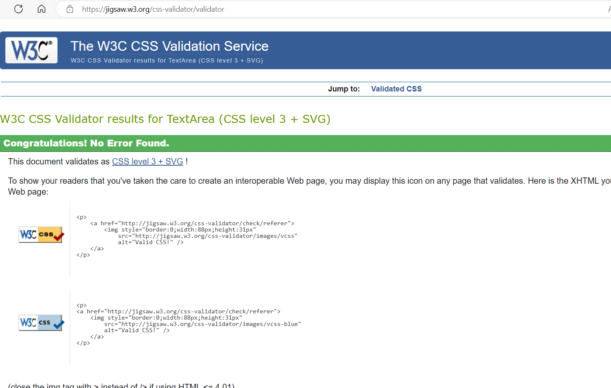

. PP8 Validator
----------------

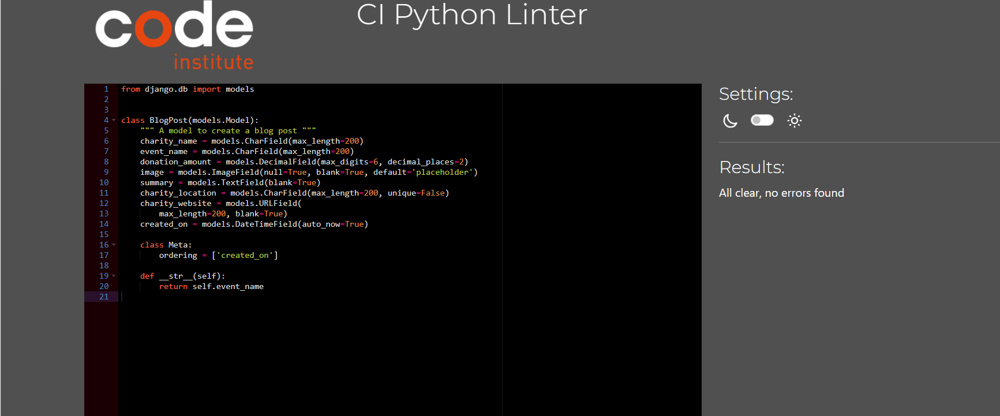

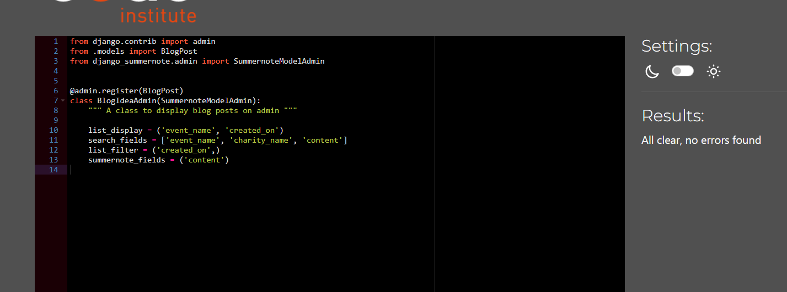

. Javascript
------------
. Lighthouse Report
------------------ 
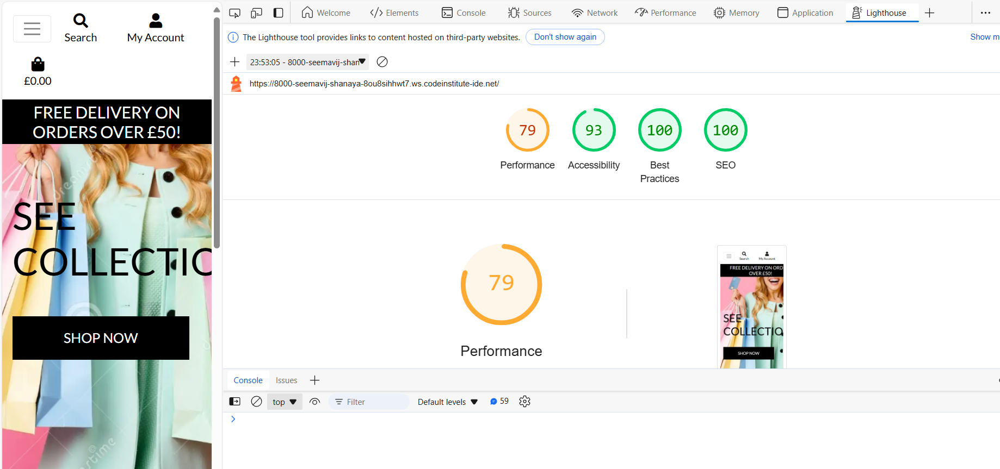

. Responsiveness
------------------ 

. Bugs
------
As well as the user story testing conducted I clicked every link and button on both desktop and mobile to confirm they are all functioning as they should but found one bug on Signup page.

. Tested all page getting bug in Sign up page after Validation.

SignUp Page:
------------
. This is a  Django allauth code.

. Getting Error on SignUp Page when doing Validation Testing Signup page shows one Error <ul> this is Bootstrap error I tried so many things and Tutor advised because of 
 Bootstrap version this error appear if I have to fix this change version of package to lower than 0.57 or otherwise declare than in Read me I am getting this Bug in Bootstrap Version.

. Deployment
------------
> Cloning Git Repository
------------------ 
>Create App on Heroku
------------------ 
>Connecting Heroku to Github
------------------ 
>Set up Amazon AWS S3 Bucket
------------------ 
>Details
---------
. References
------------
. Acknowledgements
------------------ 

Table of contents generated with markdown-toc

* Business Model :
------------------ 
Shanaya is a B2C business. The business of Shanaya is to sell Men and Women clothes to the public and sell them online on a resonable price. Shanaya sell Bridal & Groom Dresses and other women dresses. We advertise on Facebook and other social Media platform and users can share the page to spread the word about Shanaya.

* User-Experience-Design :
--------------------- 
Site Goals
--------
The site is aimed at anyone they can browse and see over new and all collection at very easily at there comfort zone, and anyone who wants to buy beautifull items. Without signing in the user can browse the online store and buy their items. They can also look at the site blog to see that are being helped by the site. They can log in to see a log of the items they have bought and leave a review of the site. They can also save their details for future purchases.

* Agile Planning :
------------------ 
! This project was developed using agile methodologies, delivering small features over 6 sprints spaced out over 6 weeks. Each issue was labelled must have, should have and could have. The must-have features were completed first, then the should have's, then the could have's. It was done this way to ensure a complete website is made with the nice-to-have features added if there is capacity.

! My kanban board was made using github projects which can be viewed here. Each view can be clicked in to obtain further information.

The user stories were grouped into different Epics

* Epic 1 - Set up
------------------ 
The base setup of the Django app was done first as nothing else can be completed before this is done. I completed the base html, and the header.

Epic 1 user stories
------------------ 
.  As a developer, I need to set up the project so that it is ready for implementing core features
.  As a developer, I want to create a base HTML page so that all pages can use the same format.
.  As a user, I want to be able to navigate around the site easily from any device
Epic 2 - Products and shopping bag

Setting up database model and admin functions and template pages to be able to view the products available to buy and have messages confirming when items have been added to the bag.

* Epic 2 User Stories
------------------ 
. As a shopper, I want to view a list of products so that I can select something to buy
. As a shopper, I want to be able to click into a product to view its details so I can see what size it is etc
. As a user, I want to be able to view what I have added to my shopping bag and the total price
. As a user, I want to be able to delete items from my bag when I decide I no longer want something.
. As a user I want to receive a confirmation when I have made changes ie, adding and removing items to my bag so that I know when a change has been completed.

! Epic 3 - payment and purchase confirmation emails.

* Epic 3 User Stories
------------------ 
Epic 3 User Stories

. As a shopper, I want to be able to easily enter my payment details so that I can purchase my chosen items.
. As a shopper, I want to see confirmation that my payment has gone through successfully and that my purchase is being sent to the correct address so that I know it has been done correctly
. As a shopper I want Shanaya to send me an email so that I can keep confirmation of purchase for my own records.

* Epic 4 Allauth User Stories
----------------------
. As a new user, I want to be able to sign up easily and intuitively
. As a returning user, I want to be able to log in easily.
. As a user, I want to be able to log out of the site safely and easily.
. As a developer, I want to ensure the forms are all the same style and look good on all devices
. As a developer I want accounts to be secure with email confirmation.

* Epic 5 - Profile Page
---------------------
. As a user, I want to be able to access a profile page so that I can see my order details
. As a user, I want to see what donations I have made in the past
. As a user, I want to be able to update my details if I have to add a new address.

* Epic 6 - Blog
----------------
. As a site user I want to be able to see where the money from the site is being sent so I can feel good about my purchases
. As a site owner I want to easily be able to add blog entries onto the Site
. As a site owner I want to be able to edit my blog posts so that I can make corrections easily
. As a site owner I want to be able to delete blog posts as necessary.
. As a site owner I want to be the only one who can create edit and delete blog posts.

* Epic 7 - Reviews

Epic 7 User Stories
------------------
. As a user, I would like to be able to read reviews about the site so I can decide if I want to use it
. As a site user who is logged in, I would like to be able to leave my own review so that I can tell others about my experience
. As a user, it would be nice to give my review a rating out of five for ease of reference
. As a site owner it would be nice to be able to reply to reviews to show a personal touch

* Epic 8 Footer

* Epic 8 User Stories
------------------
. As the site owner, I want to share social media links and contact details
. As the site owner, I want a nav bar for the site extras such as the blog, reviews and subscribe pages.

* Epic 9 - Documentation and styling

* Epic 9 Tasks
--------------
. Complete Styling on all pages and all screen sizes
. Complete Readme documentation
. Complete testing and writeup

* Scope
------------------
. Responsive Design
. Home page with information about Shanaya
. Ability to perform CRUD functionality on the Blog
. Restricted features for not logged in as users and superusers

Structure
----------
Shanaya Features :
------------------
Navbar
-------
. user story - As a user, I want to be able to navigate easily around the site from any device

. Navigation Menu
------------------
from the main top navigation bar, the user can log in or sign in. Once logged in they can access their profile page.

. They can browse all the site products and check their shopping bag. They can also search the site using the search bar.

* Home Page
------------
. User Story - As a user I want the front page to be clear and self-explanatory so I know I am in the right place
. The front page contains an image of a website. This gives the initial impression of stuff.

. The front page also contains a tagline advising the user they can shop with a button to take them to either place on the website. This gives an immediate idea of what the website is for.

. Under this is information about the site and how to shop

* Footer
---------
. User Story: As the site owner, I want to share social media links and contact details
User Story: As the site owner I want a nav bar for the site extras such as the blog, reviews and subscribe pages
. The Footer has been added to the bottom of the site and contains links to the site’s blog, reviews and donations form. Users can also subscribe to the site’s newsletter from here.

. underneath the footer navigation bar users can see the contact email for the site and links to the social media pages.

. Sign in, log in, log out

. As a new user, I want to be able to sign up easily and intuitively

. As a returning user, I want to be able to log in easily.

. As a user, I want to be able to log out of the site safely and easily.

. As a developer, I want to ensure the forms are all the same style and look good on all devices

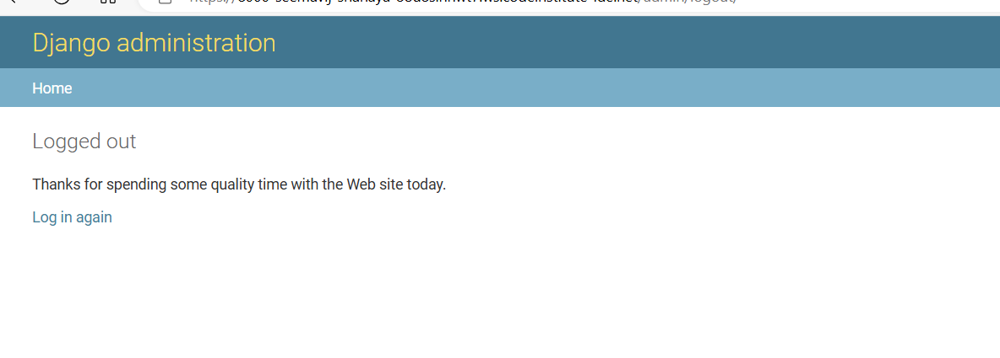

* Database :
------------
. The database was designed for the items to be tracked all the way through to sale and then recorded onto the user profile once sold.
. I originally made lots of models for the different items in the items app. They were all joined to the main items database by the primary key. The aim of this was to make it easier to put search options on the products page for different colours, sizes, age ranges of products etc. Unfortunately, I did not have time to implement all the search options I wanted to but I have left the different models in, in case of future development.

. I also added an option to add books to the items database but I decided not to add books to the site at this time. I left the model fields there though in case they can be used in the future.

. The items are connected to the user and shopping bag by primary key and are then stored on the user’s profile as past orders.

* Security :
-------------
. If statements were used to ensure that buttons that were only for the superuser were hidden from everyone else. The UserPassesTest Mixin was used to make sure the superuser is signed in to complete the blog. And to ensure that the create, edit and delete forms cannot be reached via the url.

. Environment variables were stored in an env.py file for security purposes to ensure no secret keys, api keys or sensitive information were added to the repository. These variables were added to Heroku config vars within the project

* Design :
----------
. Colour Scheme
----------------

. I opted for a simple black white and grey colour scheme. I wanted the site to look clean and simple in its design

* Typography :
-------------
. I used Alfa slab One for the logo font and Rubi for the body of the site

. I downloaded these from google fonts and imported them into the style sheet

* Imagery :
------------------
. The front page image was taken from shakutlam website which is the best Indian drresses store selection. The item pictures are either the ones used in in the google website or they came from Amazon.

* Technologies :
-----------------
. HTML
-------
>The structure of the site was made using HTML

. CSS
------

>The website was styled using CSS in an external stylesheet

. Python
--------
> Python was the main programming language used within the django app

. Github
--------
>Source code was hosted in Github

. Git
-----
>Git was used to write, commit and push code during development

.Font Awesome
-------------
>Various Font Awesome icons were used throughout the site

.Balsamiq
---------
>Balsamiq wireframes were used to plan

.javascript
-----------
>Used throughout the site

. GitHub Wiki TOC generator
------------------
>I used this to enter my table of contents. -AWS Amazon
------------------------------------------------------
> Used to store pictures -Stripe
------------------
> I used stripe payment system

* External Python Modules
------------------
> asgiref==3.8.1

> boto3==1.34.149

> botocore==1.34.149

> chardet==3.0.4

> dj-database-url==0.5.0

> Django==3.2.25

> django-allauth==0.63.6

> django-countries==7.2.1

> django-crispy-forms==1.14.0

> django-storages==1.14.4

> django-summernote==0.8.20.0

> gunicorn==20.1.0

> idna==2.8

> jmespath==1.0.1

> oauthlib==3.2.2

> pillow==10.4.0

> psycopg2==2.9.9

> python3-openid==3.2.0

> pytz==2024.1

> requests-oauthlib==2.0.0

> s3transfer==0.10.2

> sqlparse==0.5.1

> stripe==10.4.0

* Testing :

* Functional Testing

* Navigation Links

. Testing was performed on on all navigation links throughout the site. I achieved this by clicking on each link to ensure it went to the correct place.

. Shanaya => index.html
------------------
. All Products
. By Price => Arranges products by price
. By Category => Arranges products by A-Z Category
. All Products => Shows all products

Women’s
------
Bridal Dress,Sarees,Suits,gowns,Indo-western and All clothing

All these filter women’s cloths by the desired clothing type

Men’s
-----

clothes all filtered by the correct clothing types

Sherwani and Men's Suit all filter by the correct types

My Account
----------
My Profile => Profile page

Log out (if logged in) => to log out page

(if not logged in) Sign in => to sign in page

(if not logged in) Register => to Registration page

Products page
--------------
Picture => Product detail page

Sort Box => All items in the sort box were tested and sort items accordingly
Men’s

clothes all filtered by the correct clothing types

Kids’ clothes and toys all filter by the correct types

My Account
-----------
My Profile => Profile page

Log out (if logged in) => to log out page

(if not logged in) Sign in => to sign in page

(if not logged in) Register => to Registration page

Products page
------------
Picture => Product detail page

Sort Box => All items in the sort box were tested and sort items accordingly

Product Details page
------------------
Keep Shopping => goes back to the products page

Add to bag => correctly adds the item to the user’s bag this shows a success toast with the bag contents and the bag total cost shows up under the shopping bag icon.

The user can either click the cross on the toast to get rid of it or they can go to the checkout by clicking the go to secure checkout button. This works correctly

I tested adding the same item twice to the shopping bag and an error message correctly appears advising the user they can’t do that.

Bag Icon
-------
The shopping bag icon takes the user to the shopping bag.

Shopping Bag
------------
The red remove button correctly deletes the item from the shopping bag and the correct toast appears to confirm this has been successful.

The Keep Shopping button correctly takes the user back to the products page

The Secure checkout button correctly takes the user to the checkout form.

* Checkout :
------------
I checked the checkout form for positive and negative tests

I left each box blank and the form flagged an error when these were not filled in correctly. The email box flagged an error when an incorrect

Product Details page
----------------
Keep Shopping => goes back to the products page

Add to bag => correctly adds the item to the user’s bag this shows a success toast with the bag contents and the bag total cost shows up under the shopping bag icon.

The user can either click the cross on the toast to get rid of it or they can go to the checkout by clicking the go to secure checkout button. This works correctly

I tested adding the same item twice to the shopping bag and an error message correctly appears advising the user they can’t do that.

* Card Details :
----------------
I used stripes test card number to use on the site. It showed an error when the card number was input incorrectly

Order Confirmation
------------------
The order confirmation button takes the user to a thank you page confirming their email address, address and order details. A success message also correctly appears supplying the order number and confirming the confirmation email is sent to the email address given.

I checked the latest deals button takes the user back to the products page.

Once the item has been bought, it correctly no longer appears on the products page to be bought again. As this is a second hand site there is only one of each item.

Stripe
------
I checked the stripe website to make sure that the payment had gone through correctly there and the webhooks had worked correctly and all was working well.

Profile Page
-----------
I checked that the order had correctly been added to the profile page

I also updated the customer details which then changed on the checkout form the next time I bought something.

* Footer
-------
* Blog
------
. The blog button correctly takes the user to the blog list page, each blog post photo and title correctly take the user to the blog detail page for that post.

. On the blog post, only the superuser can see the create blog post button. I tested this both logged out completely and logging in as a regular user. The same applies to the delete and edit buttons located in the blog detail.

. I also used the URL to try and get to the create, edit and delete pages without the buttons and you could get there as the superuser but could not as either not logged in or logged in as a different user.

. The charity website link takes you to the correct website and it opens in a new window as it should.

. The create and edit forms both upload the information and pictures as expected. The edit form also contained all the previous information ready to edit as expected.

. Unfortunately, an error occurred in the blog form. If a picture is not correctly uploaded it caused an error on the blog list page.

. I have written about this in the bug section and it has now been fixed so it works correctly.

* Reviews :
----------
. The reviews button correctly takes the user to the reviews page, the reviews are correctly ordered with the newest first. The write a review button takes you to the form to write your review. once completed the submit button correctly takes you back to the review page where the new review is visible.

. If you are not logged in the reviews button correctly takes the user to the sign-in page

* Subscribe :
------------
. The subscribe button correctly takes the user to the mailchimp subscription page. I tested this with an email that I had already used before and it would not accept it and told me to enter a different email address as it had already been used.

. A new email address was successfully added.

. It also correctly flagged an error when an incomplete email address was added.

. All of the social media icons correctly take to you their respective social media pages which open in a new page as expected.

. The Facebook icon correctly went to the Laneys Loft Facebook page.

* Emails :
--------
. I was correctly able to set up a new user, receive an email to confirm the email address of the user, click the link to the site and confirm the email address. I then logged in with an incorrect name and email for the user and both flagged errors correctly by the system.

. A confirmation email was correctly sent once an order was completed.

* Accessibility :
----------------
. I used the Wave Accessibility tool to check for aid accessibility testing.

. The page showed a couple of errors and they were for labels on the search box in the nav bar. I added aria labels for this but the errors stayed in the box despite disappearing on the page.

. On other pages, it showed Alerts that show redundant links, on the blog picture and name.

. I have chosen to leave these links as they are because I think they make navigation around the site better.

* Validator Testing :
------------------
. All pages were run through the w3 HTML validator. Initially, there were some errors, for example, there were some missing closing tags and a

tag that was used incorrectly inside a .

. All issues were fixed and all pages run through the checker with no errors.

* PP8 Validator :
-----------------
. The pep8 validator was not working at the time of checking this project. I checked in the terminal using linter and corrected all the items shown until it said no problems detected in the workspace. There were some long lines in the settings tab in Laneys Loft that I left because they were there already. I could not find a way of screenshotting a picture of this.

* Javascript :
-------------
. I didn't use any Javascript in this project over the js used in boutique ado so I have not tested for that.

* Lighthouse Report :
------------------
. The lighthouse report initially showed a low score on performance. I compressed my hero image which fixed the problem.

* Responsiveness :
------------------
. I checked the website for responsiveness on all devices from 320px and up. I checked on Chrome, Edge, Firefox and Opera browsers.

. I did this by using developer tools and re-sizing the website to down to 320px.

. As expected, there were no responsiveness issues.

* Bugs :
-----
. Error when migration change in checkout model. File "/workspace/.pip-modules/lib/python3.8/site-packages/django/db/backends/dummy/base.py", line 20, in complain raise ImproperlyConfigured("settings.DATABASES is improperly configured. " django.core.exceptions.ImproperlyConfigured: settings.DATABASES is improperly configured. Please supply the ENGINE value. Check settings documentation for more details.

. I looked at the error and went to the database section in settings. I found a typo in the Databases and updated this to fix the problem

. Error on the product form. If a picture is not input correctly, it causes an error on the blog list page. The only way to get back in is to go into the admin panel and delete the blog post.

. After some investigation, I found that my placeholder image was not working because I had neglected to put the placeholder name in the model. Once I did this the bug was fixed.

. Error the bag information shows when the blog is being updated. I have decided to leave this bug. I have run out of time and realistically the site owner probably won’t have anything in her bag anyway.

. An error occurred when I added the UserPassesTest mixin to the blog create, edit and delete views. This caused an error page when I logged into them. I fixed this by looking at the documentation and adding a def text_func function that checked the user had the correct email address.

* Deployment 
-----------
.To deploy my site to Heroku I followed the following steps

. Navigate to heroku and create/log into account

. Click the new button in the top right corner

. Select create new app

. Enter app name (Shanaya)
-------------------------
. Select region and click create app (europe)

. Click the resources tab and search for Heroku Postgres

. Select hobby dev and continue

. Go to the settings tab and then click reveal config vars

. Make sure the correct config bars are added

. AWS_ACCESS_KEY_ID (for access to AWS)

. AWS_SECRET_ACCESS_KEY (for access to AWS)

. SECRET_KEY: (Your secret key)

. DATABASE_URL: (This should already exist with add on of postgres)

. EMAIL_HOST_USER: (email address)

. EMAIL_HOST_PASS: (email app password)

. STRIPE_PUBLIC_KEY (Stripes public key)

. STRIPE_SECRET_KEY (Stripes secret key)

. STRIPE_WH_SECRET (Stripes Web Hook secret key)

. USE_AWS (set to True to use AWS)

. Click the deploy tab
------------------
. Scroll down to Connect to GitHub and sign in / authorize when prompted

. In the search box, find the repository you want to deploy and click connect

. Scroll down to Manual deploy and choose the main branch

. than connect to repositry

. Click Deploy
--------------
. The app should now be deployed

* Credits
----------
>I created the bulk of this project following the 'Boutique Ado' walkthrough project and had to copy the entire checkout section, which is documented in my bug errors.

>>A lot of the import/ export came from here: Export Code | Review Stars Code
* References

. I used the django documentation

. I used the bootstrap documentation

. I used slack overflow

. I used CI slack community

. I followed the Boutique Ado walkthrough and used it as a base for the site.

* Acknowledgements
------------------
. I want to thank
----------------
. My mentor & Tutor for all her guidance

. The wonderful slack community

Thanks for all customers for their support.

