<h1 align="center">Shanaya</h1>

[View the live project here](https://shanaya-4953fd346fee.herokuapp.com/)  

Shanaya is a ecommerce site. It sell Bridal dresses, Indo western dresses, Men sherwani & gown online.Variety of collection and clothes for sale on reasonable rate and home delivery free on order £50

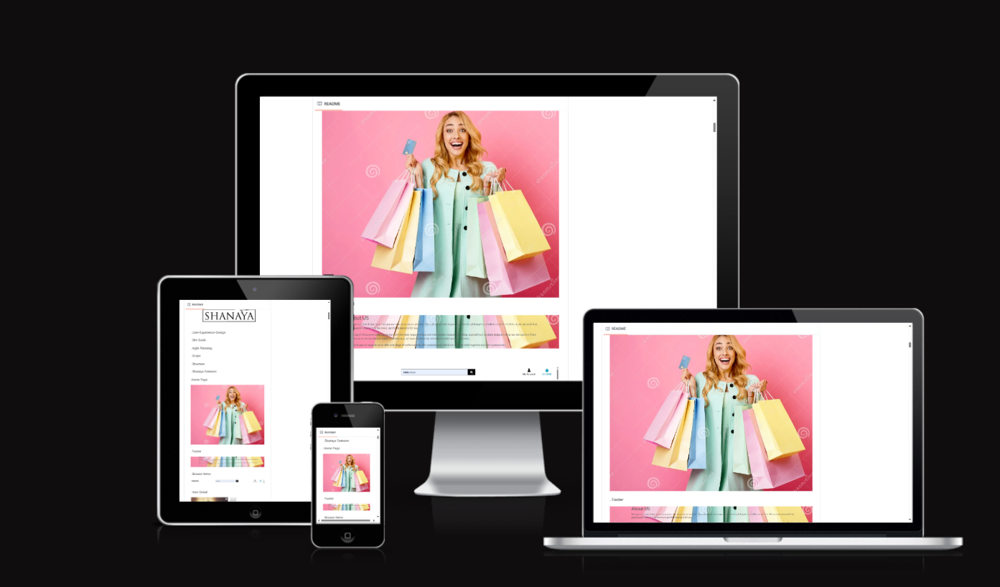

                
## Index – Table of Contents
* [User Experience (UX)](#user-experience-ux) 
* [Features](#features)
* [Design](#design)
* [Planning](#planning)
* [Technologies Used](#technologies-used)
* [Testing](#testing)
* [Deployment](#deployment)
* [Credits](#credits)

## User Experience (UX)
- All user stories can be seen here [Shanaya views](https://github.com/users/Seemavij/projects/10)

  

    
Site User Stories

    - As a **site user** I want to be able to **register for an account** so that I can **have a personal account with my delivery details saved**

    - As a **site user** I want to be able to **login and logout** so that I can **access my profile info**

    - As a **site user** I want to be able to **receive an email confirmation after sign up** so that I can **verify my account registration was successful**

    - As a **site user** I want to be able to **have a personalised user profile** so that I can **view my order history and delivery information**

    - As a **site user** I want to be able to **leave a product review** so that I can **advise potential customers with my advise**

    - As a **site user** I want to be able to **sign up to a newsletter** so that I can **get the latest news and offers**

    - As a **site user ** I want to be able to **unsubscribe for the newsletter ** so that I can **stop receiving emails**

    - As a **site user** I can **return to Home after http 404 or 500 response** so that **I feel I am still working within the website and can navigate easily**

  

  

    
Shopper User Stories

    - As a **Shopper** I want to be able to **view a list of products** so that I can **select a product to purchase**

    - As a **shopper** I want to be able to **view individual products** so that I can **check price, description, images and sizes**

    - As a **shopper** I want to be able to **view my total cost** so that I can **I don't spend too much**

    - As a **shopper** I want to be able to **sort any list of products** so that I can **easily sort by price, best rated, etc**

    - As a **shopper** I want to be able to **sort products into categories** so that I can **split products into categories to make it easier to find what I want**

    - As a **shopper** I want to be able to **search a product by name** so that I can **easily find the product I am searching for**

    - As a **shopper** I want to be able to **select a specific size** so that I can **I can make sure the product will suit my needs**

    - As a **shopper** I want to be able to **view the items in my bag** so that I can **check out my bag contents and know exactly what I am buying**

    - As a **shopper** I want to be able to **adjust the quantity of items in my bag** so that I can **easily make changes**

    - As a **shopper** I want to be able to **enter my card details** so that I can **make a purchase**

    - As a **shopper** I want to be able to **view my order after I complete a purchase** so that I can **verify I have not made any mistakes**

    - As a **shopper** I want to be able to **receive an email confirmation after making a purchase** so that I can **keep the confirmation for any future needs**

    - As a **shopper** I want to be able to **contact Shanaya** so that I can **get in touch regarding a product/ issue, etc**

  

  

    
Admin Stories

    - As an **admin** I want to be able to **add a product** so that I can **I can add new products my store**

    - As an **admin** I want to be able to **edit a product** so that I can **make changes to any product**

    - As an **admin** I want to be able to **delete a product** so that I can **remove an item that is no longer for sale**

    - As an **admin** I want to be able to **view all messages from the contact form** so that I can **communicate with customers in a timely manner**

    - As an **admin** I want to be able to **view all messages from the contact form** so that I can **communicate with customers in a timely manner**

    - As an **admin** I want to be able to **view a list of subscribers in my admin** so that I can **see the amount of subscribers we have**

    - As an **admin** I want to be able to **export a CSV list of my subscribers** so that I can **can use them in marketing campaigns using tools like Mail Chimp**

## Features

### Existing Features

#### - Header

The header features the Shanaya logo, navigation for products in the centre and three icons to the right, a search icon, an account icon and a bag icon.

#### - Search Icon and Overlay

The search icon when clicked brings up a search input below, this can be used to search the site for all products. An autofocus was added so when the search icon is clicked the user's type is on the search input.

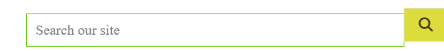

#### Account Dropdown

When clicked the account icon will display a dropdown list. Depending on the logged in status of the site user you will see different links. When the user is logged out they will see 'Register', 'Login' and 'Contact'. If the user is logged in they will see 'My Profile', 'Logout' and 'Contact'. Finally, if an admin user is logged in they will see 'Product Managment', 'My Profile', 'Logout' and 'Contact'.

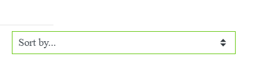

#### Bag Notification

If the user currently has nothing in their bag they will just see a bag icon. If the user adds a product or products to their bag a green circle/ bubble will appear with the number of items in their bag.

#### Hero Section

The hero section is quite simple featuring an illustration of an ecommerce style image to the right and an a site intro on the left. The hero section also features a button to 'Shop Now' that takes the user to the all products page.

#### Product Categories

Below the hero section is a Product Categories section. This section features five cards with an image. Each card will grow on hover and when clicked will take the user to that product category.

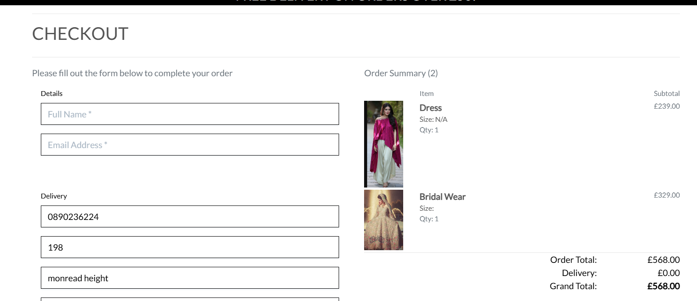

#### About Us Section

Next we have the about us section. Again,Shanaya is a shared experience for anyone who steps on our website. Our collections take inspiration from the philosophies of different parts of UK to create an outfit that goes beyond a moment to become a significant memory for you.

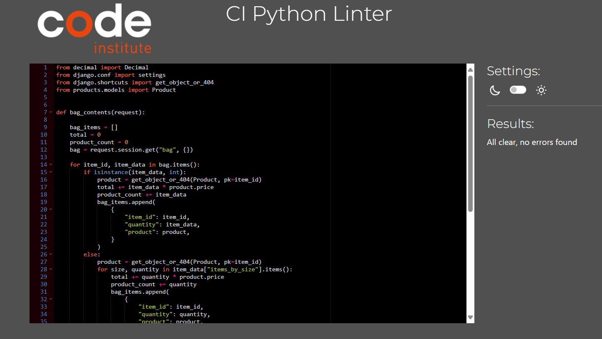

#### Our Client Carousel

At the bottom of the homepage is a carousel style section featuring some of Shanaya's previous clients. This has been animated to automatically scroll across the screen.

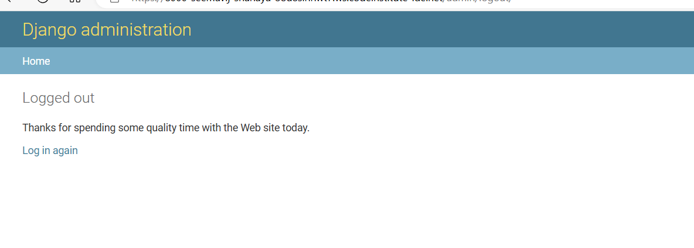

#### Footer

Finally the homepage features a footer. This footer is split into four sections. Firstly, the address section, then the products and account links. The fourth part of the footer features the Shanaya logo, a link to sign up to the newsletter below that and then social links.

There is also a link to the privacy policy at the bottom.

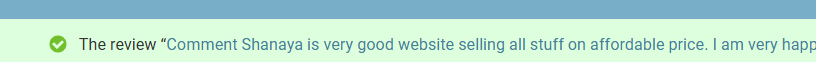

#### All Products Page

The all products page displays every product on the store as cards in rows of max 3. This page has a sort by field that allows a user to sort by price, name, rating and category. The produuct cards display the product image, title, price, rating and category below it.

The rating shown is an average of all user ratings for that product.

If the user is an admin they will see two icon buttons to edit and delete a product.

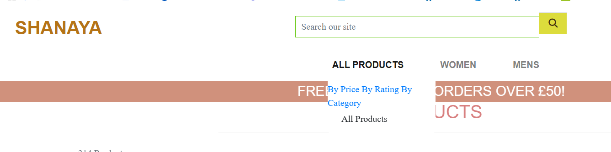

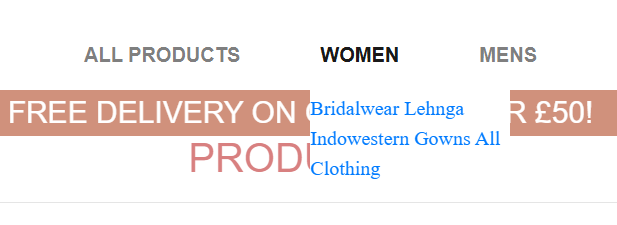

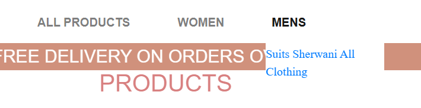

#### Edit Product

This feature is only available to admin users, when the edit button is clicked whether from the products page or product detail page it will take you to the edit product page.

An alert displays to notify the admin that they are currently editing a product. The edit product page features a rich text editor thanks to django-ckeditor.

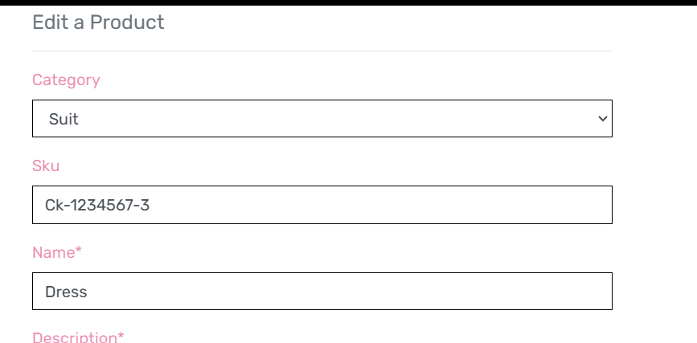

#### Delete Product

When the delete button is clicked the admin user will have a modal appear to confirm if the admin wants to delete the product.

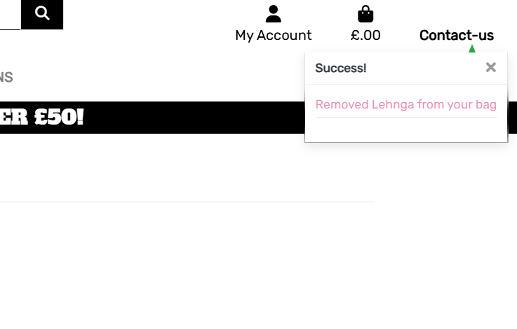

#### Product Detail Page

The product detail page features an image to the left and then on the right there is the product title, price, rating, description, the quantity and then two buttons 'Keep Shopping', that will take the user back to the products page. The 'Add to Bag' button will add the product to the user's bag.

The rating shown is an average of all user ratings for that product.

If the user is an admin they will again see two icon buttons to edit and delete a product.

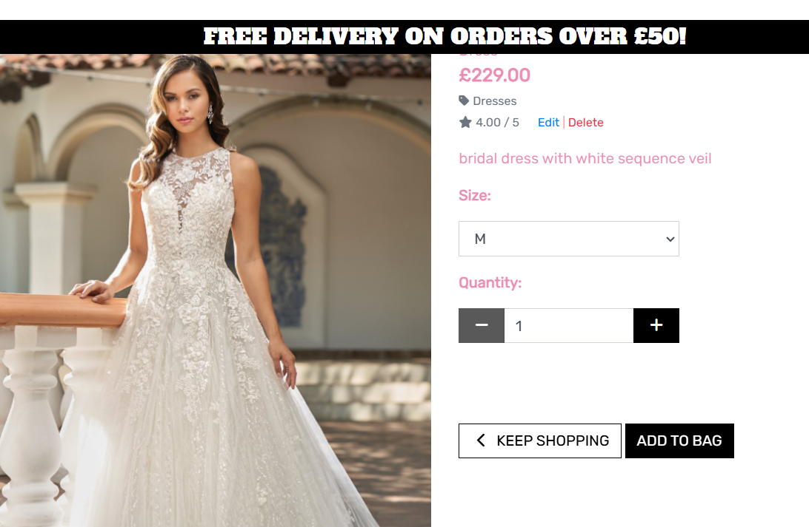

User Added to Bag:

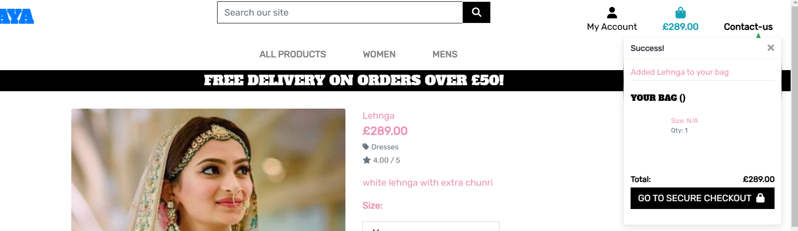

If the product has sizes a sizes option will also appear on the product detail page.

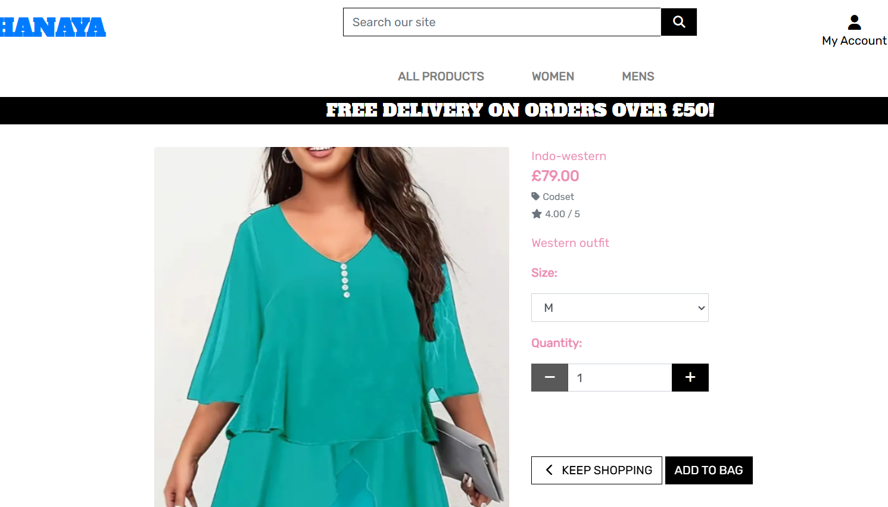

#### Product Reviews

Below the product container on the product detail page is the reviews section. When a user is signed in a product review form will show on the left side. The user reviews are then displayed on the right. These reviews have the review title, body, the user it was left by and the rating they gave.

Only the user that made the review or an admin has the ability to edit or delete it.

#### Edit Review Page

When the user clicks the edit button they are taken to a page with the edit form prefilled with their previous details. At the bottom there is two buttons. The first is to 'Delete Review', this will again take the user to a modal again to confirm delete. Then there is an 'Update Review' button that updates the review.

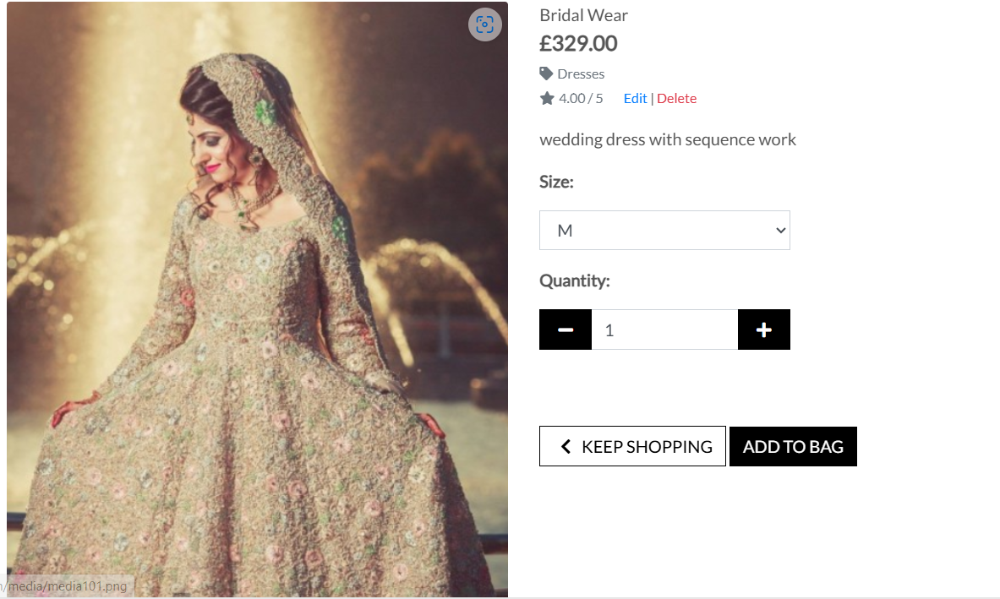

#### Add Product

As well as admin users having the ability to add products in the django admin they can also add them in the front end site. This page also features a rich text editor. 

#### Bag Page

When the user is ready to progress on to the bag page they can either click the 'Go to Secure Checkout' button on the pop up that appears after adding an item to the bag or by clicking the bag icon.

The bag page features each product as displayed as a line item. The user can edit quantites or remove items from their bag with the buttons displayed.

#### Checkout Page

The checkout page has a form to fill out the user's delivery details and card details. On the right is an order summary with the total cost.

#### Profile Page

On the my profile page the logged in user can see their saved delivery details to the left and their order history on the right. Clicking the green highlighted order number will take the user to the order confirmation history with an alert that they are viewing an old order history.

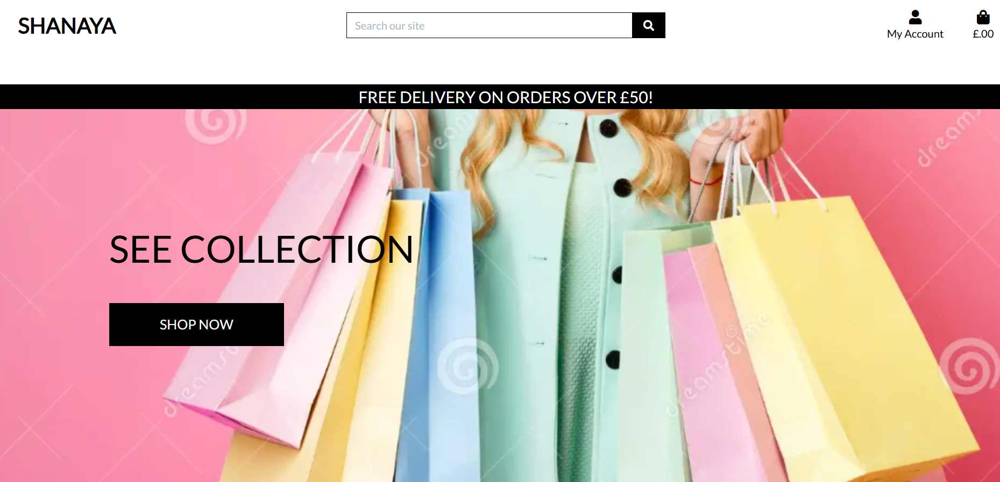

#### Contact Page

The contact page has an embedded Google Map on the left of the location of Shanaya. Next to it is a contact form with the option to select a product if their query relates to a particular product.

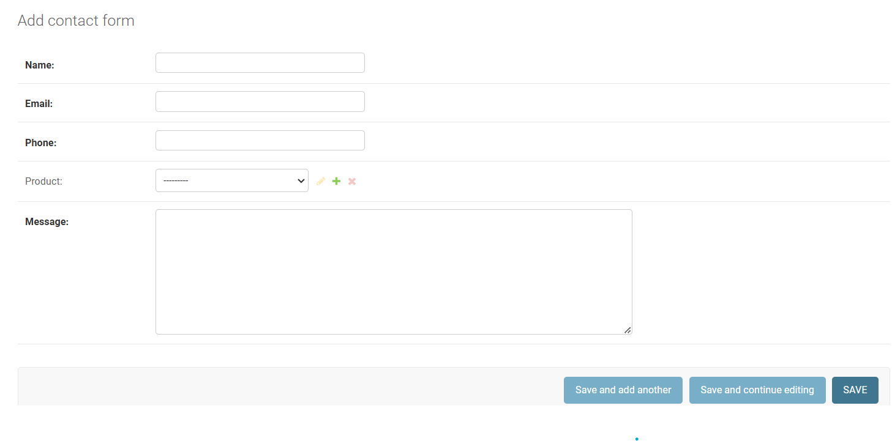

#### Newsletter Page

The newsletter sign up page features a simple input field for users to type their email address and be signed up. When submitted the user will get an alert saying that they are now signed up and receive a confirmation email.

#### Unsubscribe Page

Near identical to the sign up page, the unsubscribe page has a single input field to delete their email address from our database. When submitted the user will get an alert saying that they are now unsubsribed and receive a confirmation email.

#### Unsubscribe Page

Near identical to the sign up page, the unsubscribe page has a single input field to delete their email address from our database. When submitted the user will get an alert saying that they are now unsubsribed and receive a confirmation email.

#### Custom 404 Page

Finally, I have set up a custom 404 error page (as well as 403, 405 and 500). This presents the user with a relevant image and a link to take them back to the homepage.

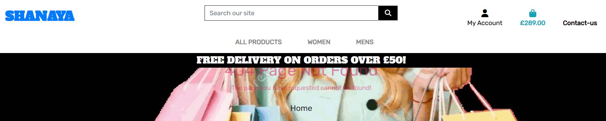

#### SEO and Web Marketing

##### __SEO__

I have taken several steps to help with the sites SEO:

1. All images have descriptive alt tags.
2. Meta desciptions are generated for each product using their product description.
3. Meta keywords for homepage of site.
4. SEO friendly description and slogan.

##### __Email Marketing__

1. A newsletter has been set up to capture emails.
2. This can easily be exported to a CSV file from either the front-end or back-end.
3. When exported Shanaya can use their email marketing service, Campaign Monitor.

##### __Social Media__

1. Although less useful for B2B products, A Facebook page for Shanaya exists.

Link here: [Shanaya Instagram Page](https://www.instagram.com/)

Shanaya's main audience can be found on Twitter, as they predominantly operate in the B2B space.

Link here: [Shanaya Twitter Page](https://x.com/)

### Features which could be implemented in the future

Below are some of the features that I will be working on over the next few weeks.

- __Draft Orders__

Due to the nature of what Shanaya sell many of their customers do not know exactly what product they need. Often times customers contact them about this. On Shopify the sales person can make create a draft order that is then sent to the customer directly to pay.

- __Order Collection__

A few Shanaya customers would prefer to collect their products from the Shanaya factory, this a feature Shanaya can offer on Shopify that I would like to implement in the future.

- __Stock/ Inventory Management__

Another feature that I would like to implement in the future is an option to import an inventory file for product management.

- __Product Gallery__

Next I would like to have a product gallery on the product detail page. 

- __Shipping Costs__

With the products that Shanaya offer varying so much in size and weight I would like to have a feature that an admin can set a product's shipping cost.

Another feature I will be implementing will be the ability to have a featured product in any given category like in my wireframes.

## Design

### Wireframes

Below are all the wireframes that I created for this project:

    
Home Page

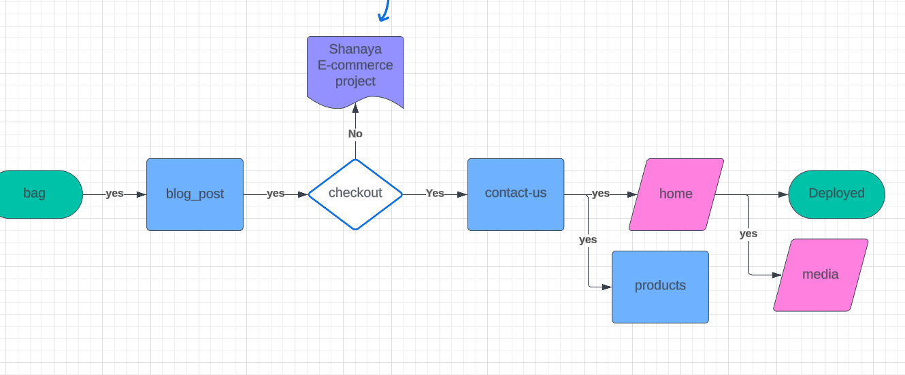

  

    
Products Page

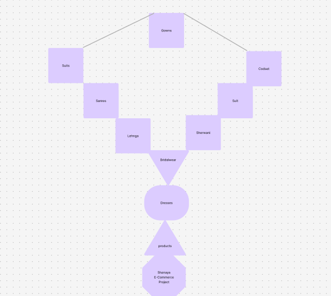

  

 

  ### Entity-Relationship diagram for DBMS

Below is an image of my entity-relationship diagrams:

## Planning

For this project I used Github Projects as an agile tool. I created user stories and moved them along the progression boards as I was at different stages.

Link can be found here: [Shanaya Github Project](https://github.com/users/Seemavij/projects/10)

## Technologies Used

### Languages Used

- HTML5
- CSS3
- JavaScript
- Python

### Frameworks, Libraries & Programs Used  

-   [Google Fonts](https://fonts.google.com/) used for the Poppins and Open Sans fonts.
-   [Font Awesome](https://fontawesome.com/) was used to add icons for aesthetic and UX purposes.
-   [Git](https://git-scm.com/) was used for version control by utilising the Gitpod terminal to commit to Git and Push to GitHub.
-   [GitHub](https://github.com/) is used as the respository for the project code after being pushed from Git. In addition, for this project GitHub was used for the agile development aspect through the use of User Stories (GitHub Issues) and tracking them on a Kanban board.
-   [Django](https://www.djangoproject.com/) was used as the framework to support rapid and secure development of the application.
-   [Bootstrap](https://getbootstrap.com/) was used to build responsive web pages.
-   [Django allauth](https://django-allauth.readthedocs.io/en/latest/index.html) used for account registration and authentication (version 0.41.0 installed because of project dependencies).
-   [Pillow](https://pillow.readthedocs.io/en/stable/index.html) - Python Imaging Library used for image handling.
-   [Django ckeditor](https://pypi.org/project/django-ckeditor/) - Renders rich text editor for various forms.
-   [jquery library](https://code.jquery.com/jquery-3.4.1.min.js) - for various pieces of functionality including adding and removing items from the shopping cart and handling the increment and decrement of the quantity control.
-   [Django crispy forms](https://django-crispy-forms.readthedocs.io/en/latest/) used to simplify form rendering.
-   [Django import export](https://django-import-export.readthedocs.io/en/latest/) used to export list of newsletter subscribers.
-   [Stripe](https://js.stripe.com/v3/) used for secure payments (referenced in base.html).
-   [Stripe install library](https://pypi.org/project/stripe/) used for secure payments.
-   [Django Countries](https://pypi.org/project/django-countries/) used on checkout page to pass valid country code to Stripe.
-   [Gunicorn](https://gunicorn.org/) was used as the Web Server to run Django on Heroku.
-   [dj_database_url](https://pypi.org/project/dj-database-url/) library used to allow database urls to connect to the postgres db.
-   [psycopg2](https://pypi.org/project/psycopg2/) database adapter used to support the connection to the postgres db.
-   [Amazon S3](https://aws.amazon.com/s3/) used to store static files and images.
-   [Boto3](https://pypi.org/project/boto3/) the Amazon Web Services (AWS) Software Development Kit (SDK) for Python.
-   [django_storages](https://django-storages.readthedocs.io/en/latest/) used to connect django to S3.
-   [Heroku](https://www.heroku.com) - used to host the deployed application.
-   [Heroku Postgres](https://www.heroku.com/postgres) - SQL database service provided by Heroku used to store models and data.
-   [Balsamiq](https://balsamiq.com/) was used to create the wireframes during the design process.
-   [Grammarly](https://app.grammarly.com/) was used to proof the content of my project and README.
-   [Beautifier.io](https://beautifier.io/) was used to beautify html and css.
-   [W3 HTML Validator](https://validator.w3.org/nu/) was used to validate HTML.
-   [W3 CSS Validator](https://jigsaw.w3.org/css-validator/) was used to validate CSS.
-   __Adobe Photoshop__ was used to create the images for category products.

## Testing
### Validator Testing 

[W3 HTML Validator](https://validator.w3.org/nu/) found a few issues that I am going to classify as bugs.

1. Products page found an error Duplicate ID exampleModalLabel. 
- This is due to me having a modal to confirm that the user wants to delete a product or review. The modal has to be in my for loop for it to work.

2. Edit product page found multiple errors.
- These errors are being caused by a django installation, ckeditor and not due to my code.

3. Product detail page found multiple errors.
- These are again being caused by django-ckeditor.

[!shanaya](media/contact-us-testing.png)
__Pages Checked__

- Home Page
- Products Page
[!shanaya](media/cover-page-testing.png)
- Product Detail Page
[!shanaya](media/css-testing.png)
- Add Product Page
[!shanaya](media/blog-forms.py.png)
- Edit Product Page
[!shanaya](media/bag-contexts.py.png)
- Edit Review Page
[!shanaya](media/blog-models.py.png)
- Profile Page
[!shanaya](media/contact-us-testing.png)
- Sign Up Page
[!shanaya](media/css-page-testing.png)
- Unsubscribe Page
[!shanaya](media/blog-views.py.png)
- Contact Page
- Bag Page
[!shanaya](media/manaul-testing.png)
- Checkout Page
- Checkout Success Page
[!shanaya](media/lighthouse-testing.png)
- Sign Up Page
- Login Page
[!shanaya](media/checkout-views.py.png)
- Logout Page
[!shanaya](media/manaul-testing.png)
- 404 Page
[!Shanaya](media/css-page-testing.png)

[W3 CSS Validator](https://jigsaw.w3.org/css-validator/) found no issues.

All code has been beautified with [Beautifier.io](https://beautifier.io/)

All code has been made PEP8 compliant.

### Manual Testing Test Cases and Results 

Below are the series of user testing that I carried out on my site.

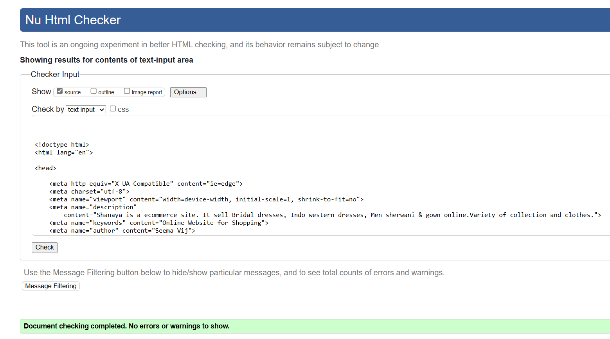

As well as the user story testing conducted I clicked every link and button on both desktop and mobile to confirm they are all functioning as they should.

### Known bugs

I had a an issue with my webhooks not working and confirmation emails subsequently not being sent. To fix this issue I had to copy over the entirety of Boutique Ado's checkout code. I then could not migrate these model changes to Heroku. This was eventually fixed but I thought that I should make note of it just in case.

## Deployment

    
Cloning Git Repository

- Go here: https://github.com/Seemavij/shanaya
- Click the 'Code' button to the right of the screen and click HTTPS and copy the link.
- Open a Git Bash terminal and go to the directory where you want the clone.
- Type 'git clone' then paste in the copied url, hit enter and the cloning should start.
- Type ' pip install -r requirements.txt'.
- Set DEBUG=True in the settings.py file.
- Any changes made to your local clone can be pushed by 'git add .' then 'git commit -m "message" and finally 'git push'.

  

 

    
Create App on Heroku

- Login to [Heroku](https://www.heroku.com/) or create an account.
- On Heroku dashboard, click 'Create New App', enter a name and choose your region. Click 'Create App'
- Click the 'Resources' tab.
- In the Add-ons search bar enter 'Postgres' and select 'Heroku Postgres' from the list, click the 'Submit Order Form' button on the pop-up dialog.
- Then go to 'Settings', scroll down to 'Reveal Config Vars'.
- Add a confif var DISABLE_COLLECTSTATIC, value: 1.
- Add SECRET_KEY, value: any random line of charaters and numbers.
- Go back to Gitpod, settings.py and add:
- if 'DATABASE_URL' in os.environ:

    DATABASES = {
        'default': dj_database_url.parse(os.environ.get('DATABASE_URL'))
    }

else:
    DATABASES = {
        'default': {
            'ENGINE': 'django.db.backends.sqlite3',
            'NAME': BASE_DIR / 'db.sqlite3',
        }
    }

SECRET_KEY = os.environ.get('SECRET_KEY')
- In your Gitpod terminal type, 'python3 manage.py migrate'.
- Then 'python3 manage.py createsuperuser'.
- Set DEBUG to False in settings.py.
- Commit and push to Github.
- Add SECRET_KEY and DATABASE_URL in env.py. 

  

    
Connecting Heroku to Github

- Go to Heroku and go to the 'Deploy' tab.
- Select Github, login to Github and find repo.
- Scroll down and choose 'Enable Automatic Deployment'

  
 

 # Bucket Config
    AWS_STORAGE_BUCKET_NAME = "shanaya"
    AWS_S3_REGION_NAME = "eu-west-1"
    AWS_ACCESS_KEY_ID = os.environ.get("AWS_ACCESS_KEY_ID")
    AWS_SECRET_ACCESS_KEY = os.environ.get("AWS_SECRET_ACCESS_KEY")
    AWS_S3_CUSTOM_DOMAIN = f'{AWS_STORAGE_BUCKET_NAME}.s3.amazonaws.com'

    STATICFILES_STORAGE = 'custom_storages.StaticStorage'
    STATICFILES_LOCATION = 'static'
    DEFAULT_FILE_STORAGE = 'custom_storages.MediaStorage'
    MEDIAFILES_LOCATION = 'media'

    STATIC_URL = f'https://{AWS_S3_CUSTOM_DOMAIN}/{STATICFILES_LOCATION}/'
    MEDIA_URL = f'https://{AWS_S3_CUSTOM_DOMAIN}/{MEDIAFILES_LOCATION}/'

  - Go to the S3 dashboard and create a folder called media in the new bucket.  Specify grant public-read access on the folder and tick the checkbox to confirm.
  - Add the AWS_ACCESS_KEY_ID and AWS_SECRET_ACCESS_KEY config vars to heroku using the values from the downloaded cvs.
  - Add USE_AWS = True to the Heroku config vars.
  - Remove DISABLE_COLLECTSTATIC from config vars.

  

 

    
Add Stripe Config Vars and Webhooks

- Create Stripe account.
- Add STRIPE_PUBLIC_KEY and STRIPE_SECRET_KEY to the Heroku config vars, you'll find these on your Stripe developer dashboard.
- Go to Stripe dashboard go to the Developers, Webhooks, click add endpoint, use the url of your Heroku application with '/checkout/wh/' added to the end of the url string.  Select all events.
- When the endpoint is set up get your signing secret from the webhook add this value as a Heroku config var called STRIPE_WH_SECRET.

  

  ## Credits 

### Code 

- I created the bulk of this project following the 'Boutique Ado' walkthrough project and had to copy the entire checkout section, which is documented in my bug errors.
- A lot of my newsletter code came from here:
[Newsletter Code 1](https://www.youtube.com/watch?v=UtV1u0pejKs&ab_channel=MasterCodeOnline) |
[Newsletter Code 2](https://www.youtube.com/watch?v=_QPuX-HD8wA&ab_channel=CodingIsThinking)
- A lot of the import/ export came from here:
[Export Code](https://python.plainenglish.io/the-easy-way-to-import-export-data-from-django-admin-fe17ecd012fb) |
[Review Stars Code](https://www.youtube.com/watch?v=gDtsAWMA3Jo&ab_channel=RathanKumar)
- The icon carousel came from tiktok user @tomisloading

### Content 

- Much of the content for products came from [Shanaya](https://shanaya.ie/). Which I used as my base idea but with the idea of improving as I went.
- The about us content came directly from [Shanaya](https://www.shanaya.ie/)
- My hero image and many of the error page illustrations came from [Many Pixels](https://www.manypixels.co/)
- 

### Acknowledgments

- Thank you to my mentor for his help and feedback throughout this project.

- Thanks to the Code Institute tutors that also helped me in this project.

The header features the Shanaya logo, navigation for products in the centre and three icons to the right, a search icon, an account icon and a bag icon.

------------

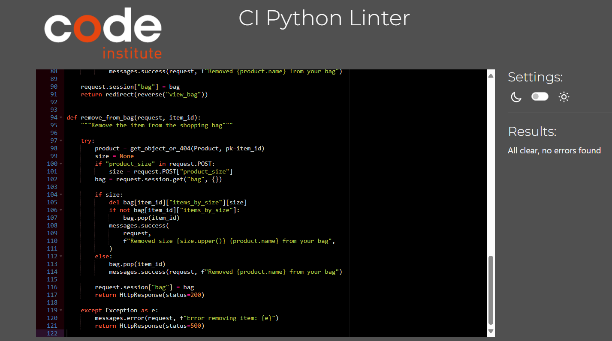

> Shanaya Features:
-----------
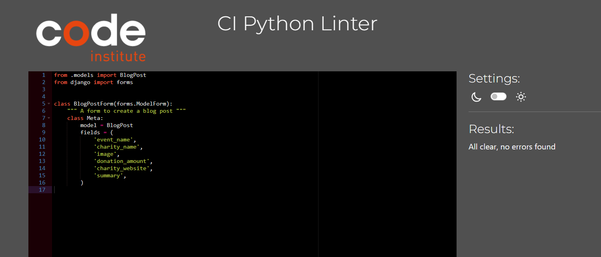

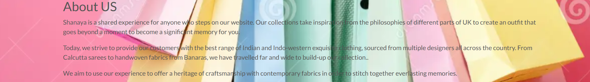

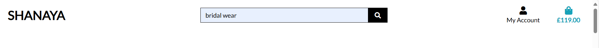

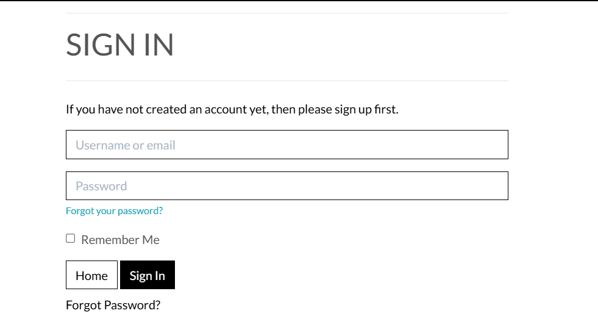

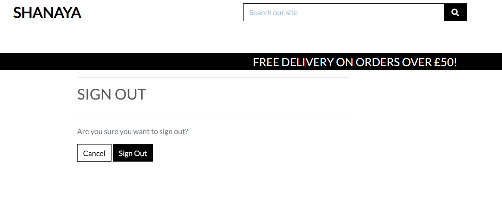

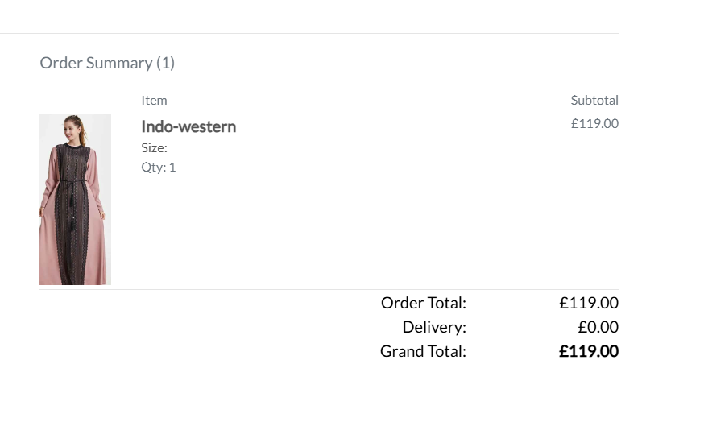

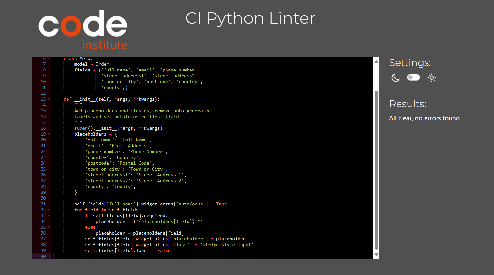

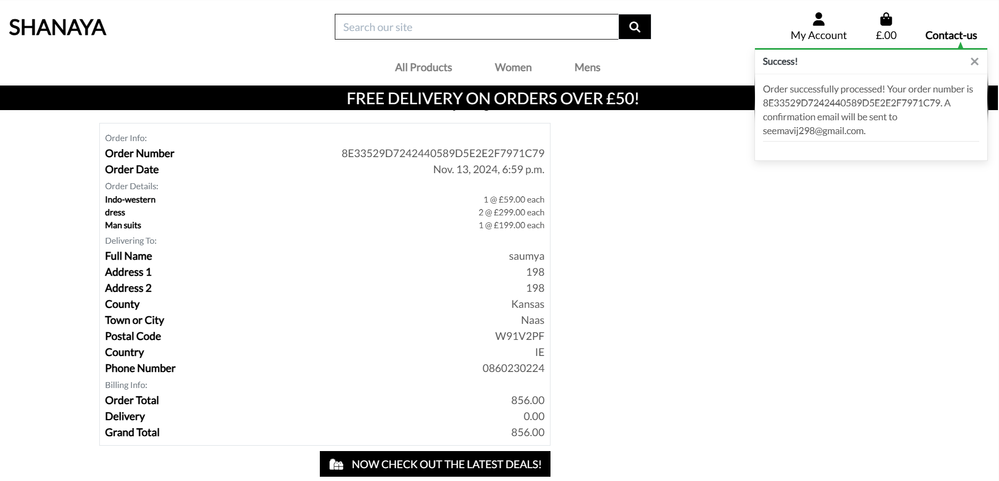

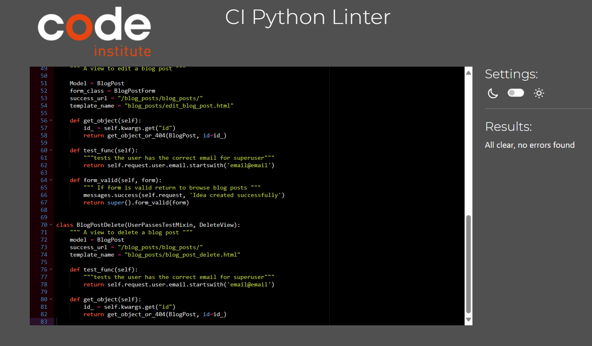

 Wireframes

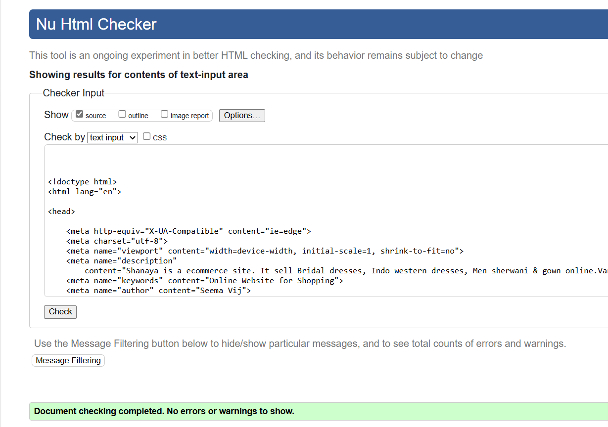

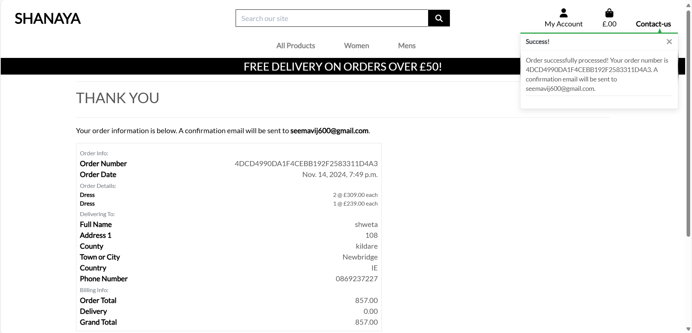

------------------ 
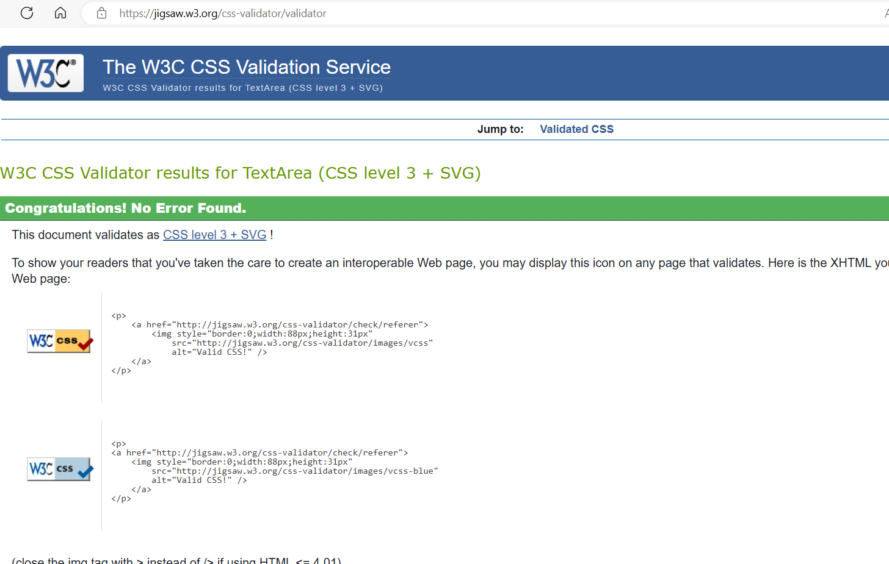

------------------

------------------

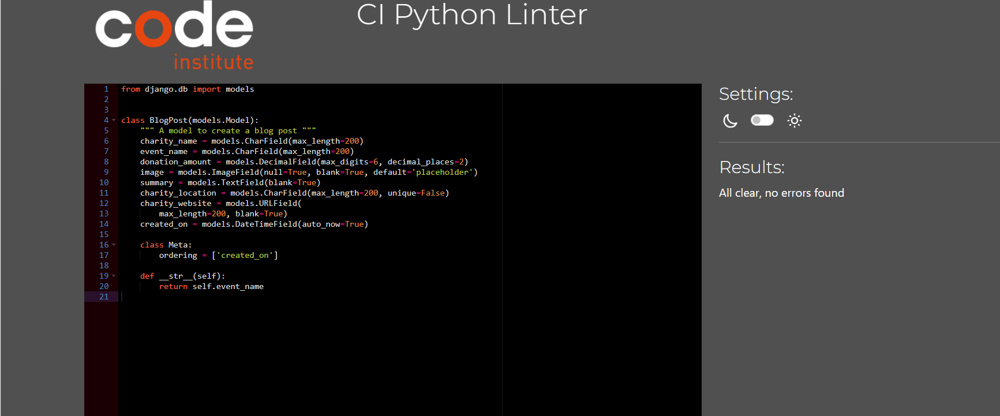

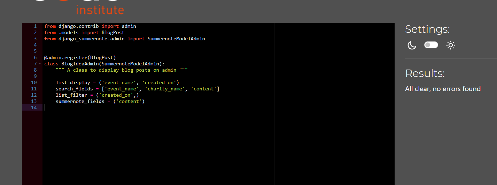

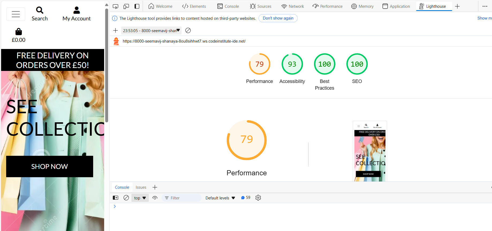

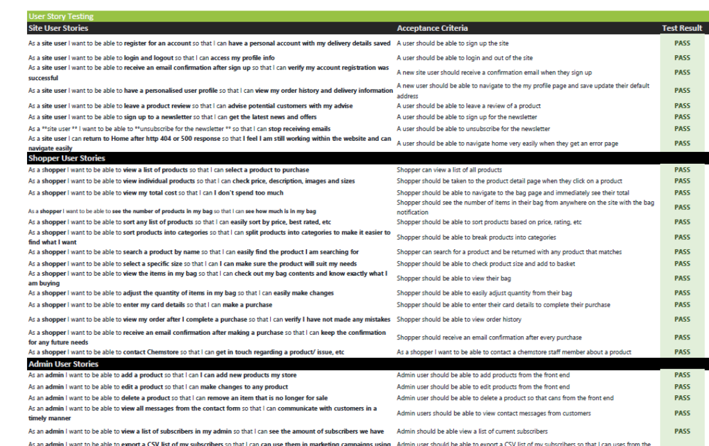

> Bugs

As well as the user story testing conducted I clicked every link and button on both desktop and mobile to confirm they are all functioning as they should but found one bug on Signup page.

. Tested all page getting bug in Sign up page after Validation.

* Agile Planning :

 This project was developed using agile methodologies, delivering small features over 6 sprints spaced out over 6 weeks. Each issue was labelled must have, should have and could have. The must-have features were completed first, then the should have's, then the could have's. It was done this way to ensure a complete website is made with the nice-to-have features added if there is capacity.

 My kanban board was made using github projects which can be viewed here. Each view can be clicked in to obtain further information.

The user stories were grouped into different Epics

Epic 1 user stories
------------------ 
.  As a developer, I need to set up the project so that it is ready for implementing core features

.  As a developer, I want to create a base HTML page so that all pages can use the same format.

.  As a user, I want to be able to navigate around the site easily from any device

Epic 2 - Products and shopping bag

Setting up database model and admin functions and template pages to be able to view the products available to buy and have messages confirming when items have been added to the bag.

* Epic 2 User Stories
------------------ 
. As a shopper, I want to view a list of products so that I can select something to buy

. As a shopper, I want to be able to click into a product to view its details so I can see what size it is etc

. As a user, I want to be able to view what I have added to my shopping bag and the total price

. As a user, I want to be able to delete items from my bag when I decide I no longer want something.

. As a user I want to receive a confirmation when I have made changes ie, adding and removing items to my bag so that I know when a change has been completed.

! Epic 3 - payment and purchase confirmation emails.

* Epic 3 User Stories
------------------ 
Epic 3 User Stories

. As a shopper, I want to be able to easily enter my payment details so that I can purchase my chosen items.

. As a shopper, I want to see confirmation that my payment has gone through successfully and that my purchase is being sent to the correct address so that I know it has been done correctly

. As a shopper I want Shanaya to send me an email so that I can keep confirmation of purchase for my own records.

* Epic 4 Allauth User Stories
----------------------
. As a new user, I want to be able to sign up easily and intuitively

. As a returning user, I want to be able to log in easily.

. As a user, I want to be able to log out of the site safely and easily.

. As a developer, I want to ensure the forms are all the same style and look good on all devices.

. As a developer I want accounts to be secure with email confirmation.

* Epic 5 - Profile Page
---------------------
. As a user, I want to be able to access a profile page so that I can see my order details.

. As a user, I want to see what donations I have made in the past.

. As a user, I want to be able to update my details if I have to add a new address.

* Epic 6 - Blog
----------------
. As a site user I want to be able to see where the money from the site is being sent so I can feel good about my purchases.

. As a site owner I want to easily be able to add blog entries onto the Site.

. As a site owner I want to be able to edit my blog posts so that I can make corrections easily.

. As a site owner I want to be able to delete blog posts as necessary.

. As a site owner I want to be the only one who can create edit and delete blog posts.

* Epic 7 - Reviews

Epic 7 User Stories
------------------
. As a user, I would like to be able to read reviews about the site so I can decide if I want to use it

. As a site user who is logged in, I would like to be able to leave my own review so that I can tell others about my experience.

. As a user, it would be nice to give my review a rating out of five for ease of reference.

. As a site owner it would be nice to be able to reply to reviews to show a personal touch.

* Epic 8 Footer

* Epic 8 User Stories
------------------
. As the site owner, I want to share social media links and contact details

. As the site owner, I want a nav bar for the site extras such as the blog, reviews

. Navigation Menu
------------------
. From the main top navigation bar, the user can log in or sign in. Once logged in they can access their profile page.

. They can browse all the site products and check their shopping bag. They can also search the site using the search bar.

* Home Page
------------
. User Story - As a user I want the front page to be clear and self-explanatory so I know I am in the right place.

. The front page contains an image of a website. This gives the initial impression of stuff.

. The front page also contains a tagline advising the user they can shop with a button to take them to either place on the website. This gives an immediate idea of what the website is for.

. Under this is information about the site and how to shop

* Footer
---------
. User Story: As the site owner, I want to share social media links and contact details.

User Story: As the site owner I want a nav bar for the site extras such as the blog, reviews.

. The Footer has been added to the bottom of the site and contains links to the site’s blog, reviews and donations form. Users can also subscribe to the site’s newsletter from here.

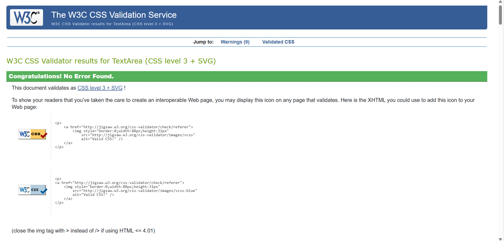
. I checked the website for responsiveness on all devices from 320px and up. I checked on Chrome, Edge, Firefox and Opera browsers.

. I did this by using developer tools and re-sizing the website to down to 320px.

. As expected, there were no responsiveness issues.

